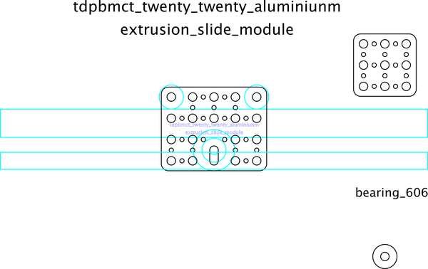

# Twenty Twenty Aluminium Extrusion Slide Module
A simple module that uses 2020 aluminium extrusion and 606 bearings to create a slide
##notes
* tdpbmct - is an acronym for three d printing manufacturing cell topology
A simple module that uses 2020 aluminium extrusion and 606 bearings to create a slide  

## corel working
 

